# Entra ID Lab

Identity and access management lab for a simulated ~12-person company across
three departments (IT, Finance, Sales), built and automated entirely with the
Microsoft Graph PowerShell SDK.

## What this demonstrates

- Least-privilege role assignment and PIM-based just-in-time admin access
- Conditional Access policies enforcing MFA and blocking legacy authentication
- Recurring access reviews for periodic recertification of group membership
- Group-based application access instead of per-user assignment
- Bulk identity operations and reporting done through scripted automation
  rather than manual portal clicks

## Prerequisites

- A Microsoft Entra ID tenant with a **P2** license (required for PIM and
  Access Reviews)
- Windows PowerShell 5.1+ or PowerShell 7+
- An account with sufficient admin rights to create users, groups, CA
  policies, PIM assignments, access reviews, and app registrations

## Setup

1. Edit `scripts/Config.ps1` and set `$TenantDomain` to your tenant's default
   domain (Entra admin center → Identity → Overview).
2. Open PowerShell in the `scripts` folder and run the scripts **in order**:

   ```powershell
   ./00-Connect-Graph.ps1          # installs modules, connects, once per session
   ./01-New-LabUsersAndGroups.ps1  # 12 users, 3 department groups
   ./02-New-ConditionalAccessPolicies.ps1
   ./03-Enable-PIMEligibility.ps1  # requires P2
   ./04-New-AccessReview.ps1       # requires P2
   ./05-New-TestAppRegistration.ps1
   ./06-Get-IAMReport.ps1          # exports CSVs to ../reports
   ```

3. Each script is idempotent-ish (checks for existing users/groups before
   creating), so it's safe to re-run `01` if it's interrupted partway through.

> Graph SDK cmdlet names occasionally shift between module versions. If a
> command isn't found, run `Find-MgGraphCommand -Command <partial-name>` to
> locate the current name for your installed version.

## Evidence

Screenshots from an actual run against a live Entra ID P2 tenant, in order:

**1. Tenant domain confirmed**
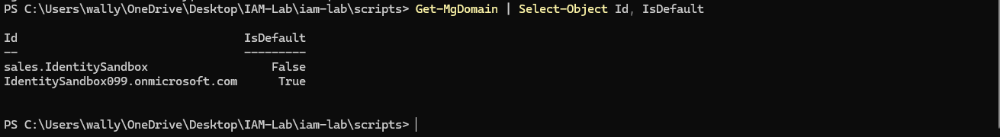
`Get-MgDomain` confirming the tenant's default domain before running any provisioning scripts.

**2. Users and department groups created**
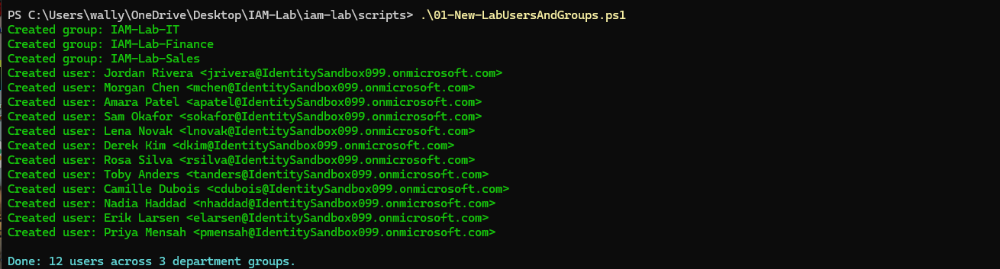
`01-New-LabUsersAndGroups.ps1` bulk-creating 3 department groups and 12 users from a CSV.

Confirmed in the portal:
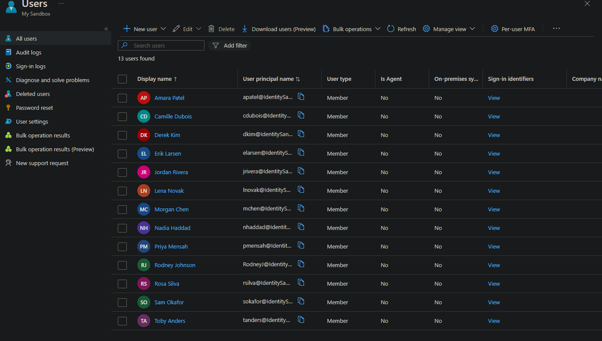
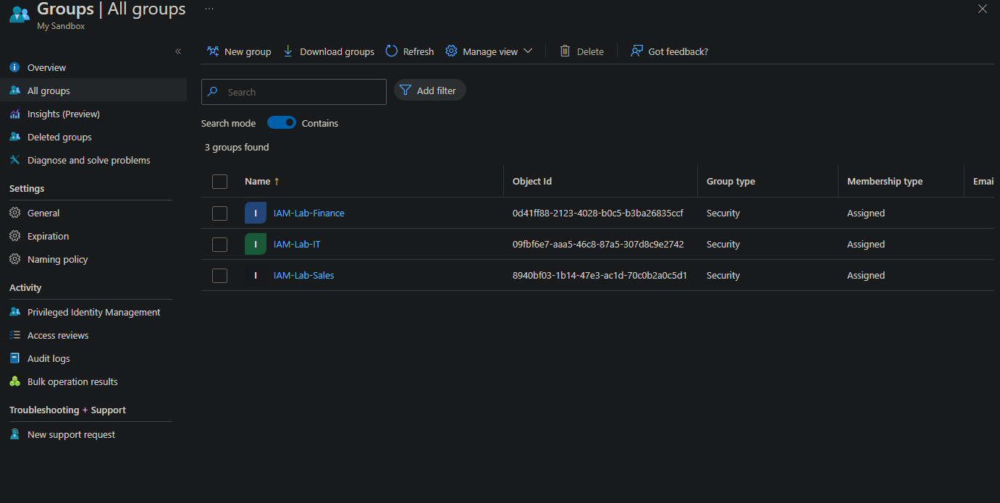

**3. Conditional Access policies created**
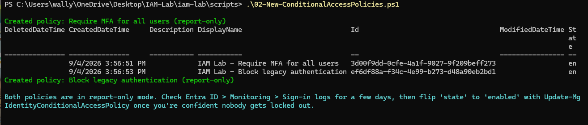
`02-New-ConditionalAccessPolicies.ps1` creating the MFA-enforcement and legacy-auth-block policies in report-only mode.

Confirmed in the portal:
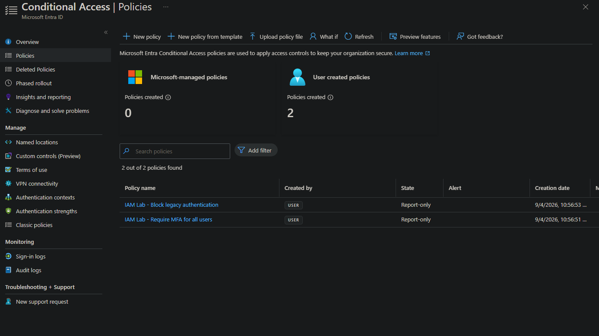

**4. PIM eligibility assigned**
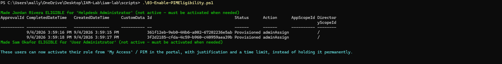
`03-Enable-PIMEligibility.ps1` granting just-in-time role eligibility instead of standing admin access.

**5. Access review created**
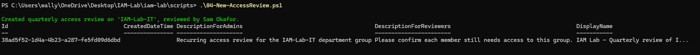
`04-New-AccessReview.ps1` setting up a recurring quarterly recertification of the IT group's membership.

Confirmed in the portal:
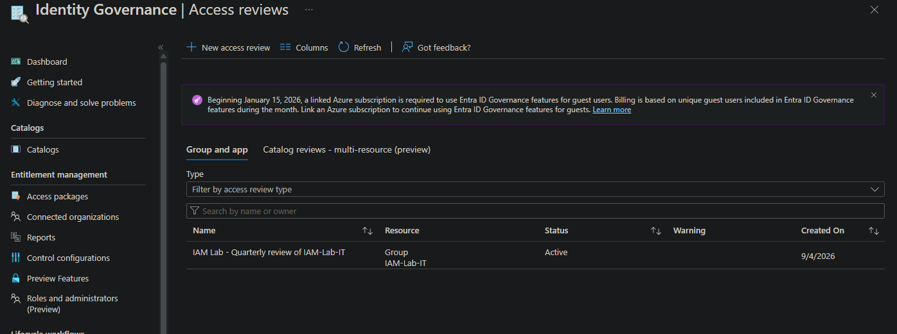

**6. Test app registered and assigned**
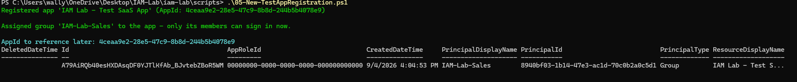
`05-New-TestAppRegistration.ps1` registering a test app and restricting sign-in to the Sales group only.

Confirmed in the portal:
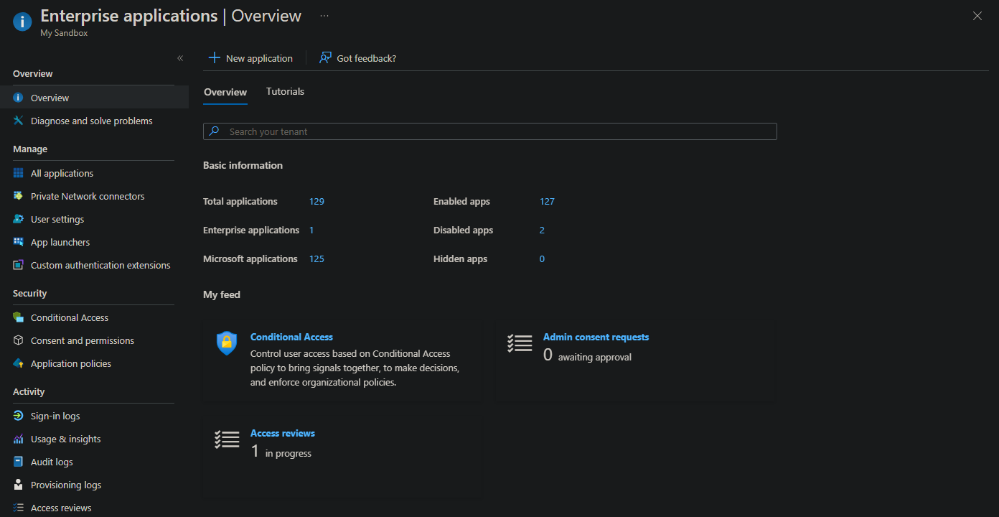

**7. Reports generated**
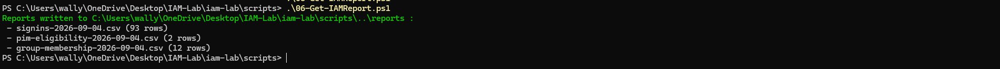
`06-Get-IAMReport.ps1` exporting sign-in, PIM eligibility, and group membership data to CSV.

## Design decisions worth calling out in an interview

- **Conditional Access policies ship in report-only mode.** Enforcing an
  untested MFA policy tenant-wide is how you lock yourself out. Report-only
  lets you check sign-in logs for a few days before flipping to enforced.
- **No standing admin roles.** `03` grants PIM *eligibility*, not active
  assignment — admins request activation with a justification and a time
  limit when they actually need the role, which is the real mitigation for
  compromised-credential blast radius.
- **App access is group-based, not per-user.** Add someone to Sales and
  they inherit app access; remove them and it's revoked automatically. This
  is also what makes the access review meaningful — reviewing group
  membership *is* reviewing app access.
- **Reporting is scripted, not manual.** `06` is the difference between
  being able to say "I checked" and being able to produce a CSV of exactly
  who signed in from where, who's eligible for what role, and who's in which
  group, on demand.

## What's intentionally out of scope here

Lifecycle workflows (automated joiner/mover/leaver), custom RBAC roles
beyond the built-ins, and multi-tenant scenarios weren't included, to keep
this lab focused and shippable. Worth mentioning as "next steps" in a
portfolio writeup if you want to signal awareness of the fuller picture.
